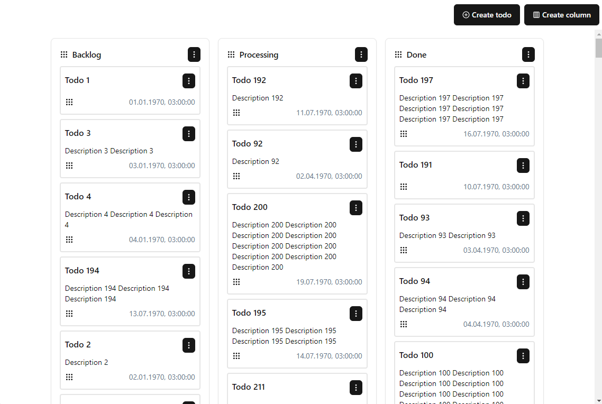

# Todos kanban

## React + TypeScript + Effector + DnD + Vite

A Kanban board with todos combines the visual organization of Kanban with task management. It allows you to visualize your tasks as cards on a board, divided into columns representing different stages (like To Do, In Progress, and Done).

